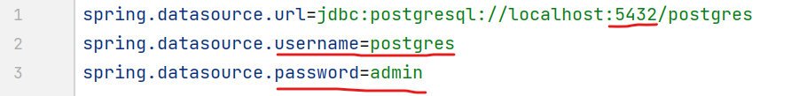
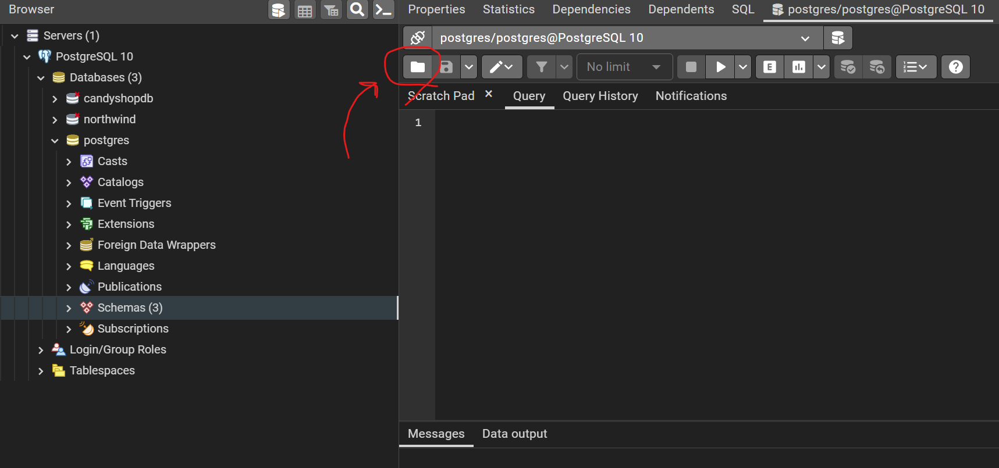
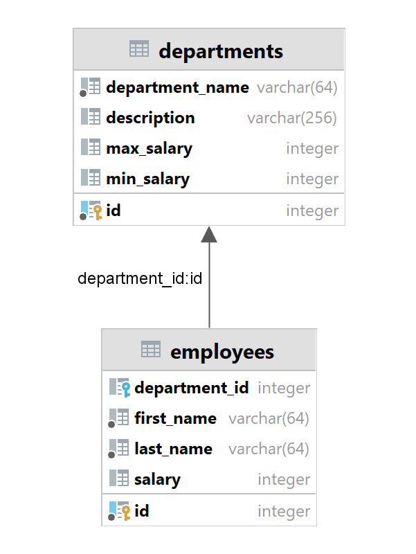

# REST API One-To-Many
Java Spring Boot application. Тестовое задание для компании Digital Chief

## Как собрать и запустить приложение
* Скачать проект с GitHub
* Для работы приложения необходим PostgreSQL, работающий на порту 5432
* В файле src/main/resources/application.properties в первых трех строках изменить username и password, по которым
приложение сможет войти в пользователя БД. Если приложение работает не на порту 5432, то порт так же можно изменить в
первой строке. Изначально в файле стоят значение пароля "admin" и имени пользователя "postgres"

    Настройка приложения через application.properties файл

* Выполнить скрипт schema.sql, находящийся в src/main/resources/sql/schema.sql . Скрипт создаст схему БД d_chief c
необходимыми таблицами
    * Выполнить скрипт можно несколькими способами:
      * Открыть файл через инструмент pgAdmin 
      * Выполнить .sql скрипт через psql. Для этого нужно в psql подключиться к БД, которая будет содержать схему, 
      и выполнить команду **\i <путь_к_файлу>**
      * Любой другой способ. Например, через IDE IntellijIdea
* Выполнить сборку проекта. Для этого нужно выполнить команду **mvn package**, находясь в дирекории проекта.
Maven соберет проект в папку target 
* Запустить .jar файл из папки target. Для этого нужно написать команду
**java -jar .\target\digital-chief-task-1.0.0.jar**
* Приложение запустится на порту 8000

## Описание предметной области и композиции

REST-приложение представляет собой API для управления базой данных сотрудников небольшой компании. 
Каждый сотрудник привязан определенному отделу. В одном отделе может работать несколько сотрудников,
то есть между отделом и сотрудниками связь "один ко многим".

Для хранения информации об отделах существует таблица departments.
В Java-коде эта таблица представлена Entity Department. У каждого Department есть свой ID,
название, краткое описание, а так же условные значения максимальной и минимальной возможной зарплаты
у сотрудников этого отдела. 

Информация о сотрудниках хранится в таблице employees и представлена Entity Employee.
У каждого сотрудника есть поля: ID, отдел, имя, фамилия, зарплата. 

Таким образом, БД представляет собой две таблицы, связь между которыми "один ко многим"

    Схема БД с отделами и сотрудниками. Одна таблица ссылается на другую через department_id
## Описание зависимостей, подключенных в проект

Приложение содержит следующие зависимости:
* spring-boot-starter-data-jpa
  * Этот пакет предоставляет инструменты для доступа к базе данных, для реализации объектно-реляционного отображения.
В него входят такие зависимости, как JDBC и Hibernate
* spring-boot-starter-web
  * Пакет предоставляет инструменты для работы с REST-приложениями, для работы сервера Tomcat.
* postgresql driver
  * Драйвер для работы с БД Postgres
* spring-boot-starter-test
  * Пакет для работы с тестированием